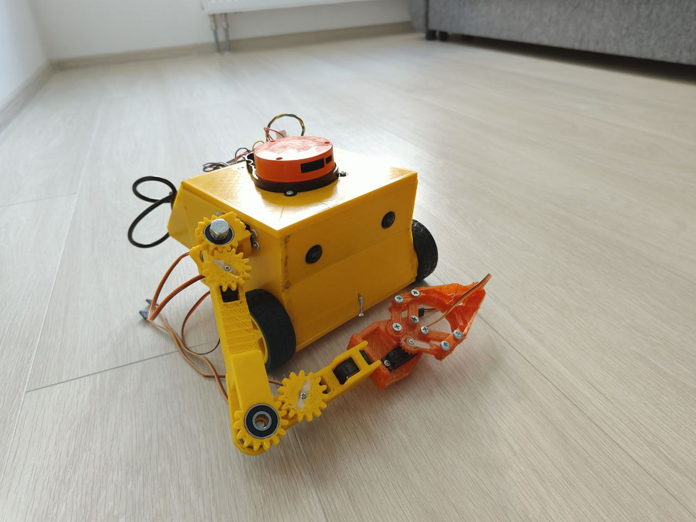

# 🧹 Socks-Bot — робот-уборщик на ROS2

**Socks-Bot** — это экспериментальная платформа мобильного робота-уборщика, разработанная на базе **ROS2 Jazzy**, **Raspberry Pi 4** и **ESP32**.  
Робот оснащён манипулятором, лидаром, камерой для стереозрения и акселерометром, что позволяет ему выполнять задачи навигации, распознавания объектов и взаимодействия с окружающей средой.

---

## ⚙️ Аппаратная архитектура

- **База:** Raspberry Pi 4  
- **Контроллер двигателей:** ESP32 (microROS через UART) https://github.com/PeshkovMikhail/esp-diff-bot
- **Приводы:** DC-моторы с магнитными энкодерами энкодерами AS5600
- **Манипулятор:** 5-осевой на сервоприводах  
- **Сенсоры:**
  - Лидар LDS01RR
  - Стереокамера
  - Акселерометр MPU6050

---

## 🖥️ Программное обеспечение

- **ОС:** Ubuntu 24.04  
- **Фреймворк:** ROS2 Jazzy  
- **Языки:** Python, C++  
- **Основные компоненты:**
  - Узел для управления моторами (ESP32)  
  - Узел для лидара  
  - Публикация команд движения через `/cmd_vel`  
  - Сканирование пространства с использованием лидара  

---

## 📌 Текущий статус проекта

✅ Управление движением через топик `/cmd_vel`  
✅ Лидар публикует карту окружения   
✅ Базовая интеграция сенсоров через ROS2  

⚠️ В работе:  
- Исправление одометрии (шумные показания с энкодеров)  
- Симуляция в Gazebo 

🛠️ В планах:  
- Интеграция YOLO для распознавания предметов на полу  
- Работа манипулятора через moveit
- Использование стереозрения для оценки размеров объектов и способов их перемещения
- Сортировка предметов в контейнеры с QR-маркировкой  
- Полноценная карта навигации и SLAM  